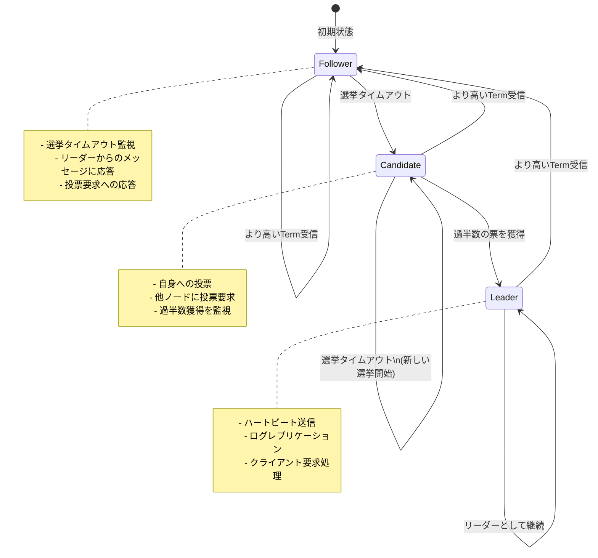

# Raftアルゴリズム状態機械仕様書

## 概要

このドキュメントは、分散KVストアにおけるRaftアルゴリズムの状態機械の詳細仕様を定義します。Raftアルゴリズムでは、各ノードが3つの状態のいずれかを持ち、これらの状態間での遷移によって分散合意が実現されます。

## 状態の定義

### 1. Follower（フォロワー）状態

**概要**: ノードの初期状態およびリーダーからの指示に従う受動的な状態

**責務**:
- リーダーからのAppendEntriesメッセージ（ハートビート含む）に応答
- 候補者からの投票要求に対して投票判定を行う
- 選挙タイムアウト時間内にリーダーまたは有効な候補者から連絡がない場合、Candidate状態に遷移

**状態データ**:
```typescript
{
  type: 'follower';
  leaderId?: NodeId; // 現在のリーダーのID（判明している場合）
}
```

**振る舞い**:
- 選挙タイムアウトのリセット（リーダーからのメッセージ受信時）
- ログエントリの追加受諾
- より高いTermの受信時の自動状態更新

### 2. Candidate（候補者）状態

**概要**: リーダーを選出するための選挙を開始する状態

**責務**:
- 自身への投票を開始し、他のノードに投票要求を送信
- 過半数の票を獲得した場合、Leader状態に遷移
- より高いTermを受信した場合、Follower状態に遷移
- 選挙がタイムアウトした場合、新しい選挙を開始

**状態データ**:
```typescript
{
  type: 'candidate';
}
```

**振る舞い**:
- Termの自動インクリメント
- 自分自身への投票
- 他ノードへの投票要求送信
- 投票結果の集計

### 3. Leader（リーダー）状態

**概要**: クラスタ内の唯一のリーダーとしてログレプリケーションを管理する状態

**責務**:
- 定期的なハートビート送信（空のAppendEntriesメッセージ）
- クライアントからのコマンドをログエントリとして追加
- フォロワーへのログレプリケーション
- ログのコミット管理

**状態データ**:
```typescript
{
  type: 'leader';
}
```

**振る舞い**:
- 定期的なハートビート送信
- ログエントリのレプリケーション
- コミットインデックスの管理

## 状態遷移図



## 状態遷移の詳細条件

### Follower → Candidate
- **条件**: 選挙タイムアウト時間（150-300ms のランダム）内にリーダーからの有効なメッセージを受信しない
- **処理**: 
  - 現在のTermをインクリメント
  - 自分自身に投票
  - 他の全ノードに投票要求を送信

### Candidate → Leader
- **条件**: クラスタの過半数のノードから投票を獲得
- **処理**:
  - 全フォロワーに空のAppendEntriesメッセージ（ハートビート）を送信
  - リーダーとしての初期化処理

### Candidate → Follower
- **条件**: 
  - より高いTermを持つAppendEntriesメッセージを受信
  - より高いTermを持つ他のリーダーからのハートビートを受信
- **処理**:
  - 受信したTermで自身のTermを更新
  - 投票記録をクリア

### Leader → Follower
- **条件**: より高いTermを持つメッセージを受信
- **処理**:
  - 受信したTermで自身のTermを更新
  - リーダーとしての活動を停止

### Candidate → Candidate（選挙再開）
- **条件**: 選挙タイムアウト時間内に過半数の票を獲得できない
- **処理**:
  - 現在のTermをインクリメント
  - 新しい選挙を開始

## Term管理

**Term（任期）** は論理的な時間を表す単調増加する整数です：

- 各ノードは現在のTermを記憶
- より高いTermのメッセージを受信した場合、自動的にTermを更新してFollower状態に遷移
- Candidate状態に遷移する際にTermをインクリメント
- 同一Term内では各ノードは最大1回のみ投票可能

## 投票メカニズム

### 投票の条件
候補者への投票は以下の条件をすべて満たす場合のみ行われます：

1. 候補者のTermが自身のTerm以上
2. 同じTerm内で未投票または同じ候補者への投票
3. 候補者のログが自身のログと同等以上に最新

### ログの新しさ判定
ログの新しさは以下の順序で判定：

1. **Termの比較**: より高いTermのログエントリを持つ方が新しい
2. **インデックスの比較**: Termが同じ場合、より大きなインデックスを持つ方が新しい

## タイムアウト設定

### 選挙タイムアウト
- **範囲**: 150ms - 300ms（ランダム）
- **目的**: 分割選挙の回避
- **リセット条件**: 有効なAppendEntriesまたは投票要求の受信

### ハートビートインターバル
- **間隔**: 50ms（選挙タイムアウトの1/3程度）
- **目的**: リーダーの生存証明
- **送信条件**: Leader状態で定期的に送信

## エラー処理

### 無効なTerm
- より古いTermのメッセージは無視
- 応答にて現在のTermを送信して相手に更新を促す

### 通信エラー
- 一時的な通信エラーは再試行
- 永続的なエラーはノードを利用不可として扱う

### 分割選挙
- タイムアウト時間のランダム化により自然解決
- 必要に応じて新しいTermで選挙を再開

## 実装上の注意点

1. **状態の一貫性**: 状態遷移は原子的に実行
2. **永続化**: Term、投票記録、ログは永続化が必要
3. **同期**: 並行処理での状態変更は適切に同期
4. **ログレベル**: 状態遷移は重要なイベントとして記録
5. **テスト**: 各状態遷移パスを網羅的にテスト

## 関連仕様

- [02-log-replication.md](02-log-replication.md) - ログレプリケーション
- [03-leader-election.md](03-leader-election.md) - リーダー選出
- [04-safety.md](04-safety.md) - 安全性保証