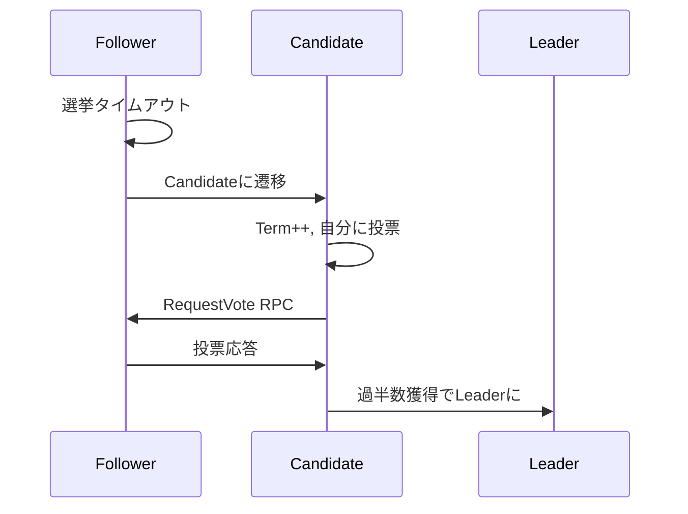

# リーダー選出仕様

## 概要
Raftのリーダー選出メカニズムを実装する。
分散環境で唯一のリーダーを確実に選出する。

## 選挙の流れ

### 1. 選挙の開始


### 2. RequestVote RPC
リクエスト:
- term: 候補者のterm
- candidateId: 候補者のID
- lastLogIndex: 候補者の最後のログインデックス
- lastLogTerm: 候補者の最後のログのterm

レスポンス:
- term: 投票者の現在のterm
- voteGranted: 投票したかどうか

### 3. 投票の条件
ノードが投票する条件:
1. 候補者のterm ≥ 自分のterm
2. そのtermでまだ誰にも投票していない
3. 候補者のログが自分と同じくらい新しい

### 4. ログの新しさ判定
```
if (candidateLastTerm > myLastTerm) return true
if (candidateLastTerm == myLastTerm && candidateLastIndex >= myLastIndex) return true
return false
```

## タイミング制約
- 選挙タイムアウト: 150-300ms（ランダム）
- RPCタイムアウト: 50ms
- 選挙完了目標: 500ms以内

## Split Vote対策
- タイムアウトのランダム化
- 選挙失敗時の再ランダム化
- バイナリエクスポネンシャルバックオフ（オプション）

## エラーケース
- ネットワーク分断での少数派
- 同時に複数の候補者
- 古いtermのリクエスト

## 実装の詳細

### 選挙の開始フロー
1. Followerが選挙タイムアウトを検出
2. Candidateに状態遷移
3. 現在のTermを+1
4. 自分自身に投票
5. 全ピアに並行してRequestVote RPCを送信
6. 投票結果を集計
7. 過半数獲得でLeader、そうでなければ新しいタイムアウトで再試行

### 投票判定ロジック
投票する条件の詳細:
```typescript
function shouldVote(request: RequestVoteRequest): boolean {
  // 1. 古いTermは拒否
  if (request.term < currentTerm) return false;
  
  // 2. 新しいTermなら受け入れ、同じTermなら投票済みチェック
  if (request.term > currentTerm) {
    // 新しいTermなので更新
    updateTerm(request.term);
  } else if (votedFor !== null && votedFor !== request.candidateId) {
    // 同じTermで既に他の候補者に投票済み
    return false;
  }
  
  // 3. ログの新しさをチェック
  return isLogUpToDate(request.lastLogTerm, request.lastLogIndex);
}
```

### ログの新しさ判定
```typescript
function isLogUpToDate(candidateTerm: Term, candidateIndex: LogIndex): boolean {
  const myLastTerm = log.getLastTerm();
  const myLastIndex = log.getLastIndex();
  
  // 候補者のログが新しいTermを持つ
  if (candidateTerm > myLastTerm) return true;
  
  // 同じTermで、候補者のインデックスが同じか新しい
  if (candidateTerm === myLastTerm && candidateIndex >= myLastIndex) return true;
  
  // その他は古い
  return false;
}
```

## 同時実行制御

### 状態の一貫性
- 投票集計中に状態変更が発生する可能性を考慮
- より高いTermを受信した場合は即座にFollowerに遷移
- 投票集計時に現在の状態を再確認

### 競合状態の回避
- 同一Term内での複数投票を防ぐ
- RPCレスポンス処理時のTerm更新
- タイマーの適切なリセット

## パフォーマンス要件
- 選挙完了時間: 500ms以内（通常時）
- ネットワーク分断回復後: 1秒以内でリーダー選出
- Split Vote発生時: 平均3回以内の試行で収束

## エラーハンドリング
- ネットワークエラー: 投票なしとして扱う
- RPCタイムアウト: 部分的な結果で判定
- 古いTermのリクエスト: 現在Termを返して拒否