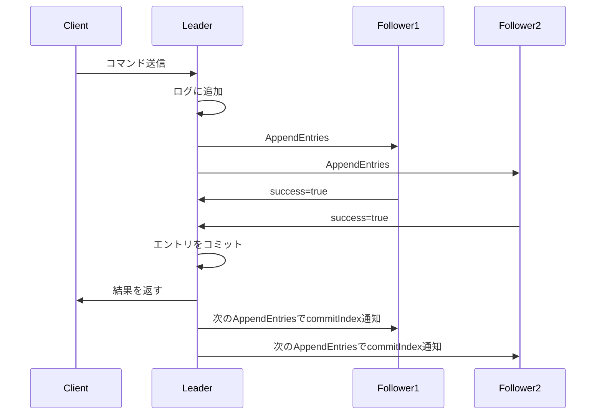

# ログレプリケーション仕様

## 概要
リーダーがログエントリを全Followerに複製し、一貫性を保証する。

## AppendEntries RPC

### リクエスト構造
```
{
  term: リーダーのterm
  leaderId: リーダーのID
  prevLogIndex: 新エントリの直前のインデックス
  prevLogTerm: prevLogIndexのterm
  entries: 送信するエントリ（空=ハートビート）
  leaderCommit: リーダーのコミットインデックス
}
```

### レスポンス構造
```
{
  term: Followerの現在term
  success: 成功/失敗
  matchIndex: 一致した最後のインデックス（成功時）
  conflictIndex: 競合位置（失敗時）
  conflictTerm: 競合エントリのterm（失敗時）
}
```

## レプリケーションフロー



## ログ一貫性の保証

### Log Matching Property
1. 異なるログの同じインデックス・同じtermのエントリは同じコマンド
2. そこまでのすべてのエントリも同じ

### 一貫性チェック
```python
def check_consistency(prevLogIndex, prevLogTerm):
    if prevLogIndex == 0:
        return True  # 最初のエントリ
    
    if len(log) < prevLogIndex:
        return False  # エントリが存在しない
    
    entry = log[prevLogIndex - 1]
    return entry.term == prevLogTerm
```

### 競合解決
1. prevLogIndex/prevLogTermが一致しない場合
2. Followerは競合位置を返す
3. リーダーはnextIndexを減らして再送信
4. 一致点が見つかるまで繰り返す

## コミットルール

### エントリのコミット条件
1. 過半数のノードにレプリケーション完了
2. 現在のtermのエントリである（Figure 8問題の回避）

### コミットインデックスの更新
```python
def updateCommitIndex(matchIndices):
    # 過半数がレプリケーションした最大インデックスを探す
    sorted_indices = sorted(matchIndices)
    majority_index = len(sorted_indices) // 2
    candidate = sorted_indices[majority_index]
    
    # 現在termのエントリのみコミット
    if log[candidate].term == currentTerm:
        commitIndex = max(commitIndex, candidate)
```

## ハートビート

### 送信タイミング
- heartbeatInterval（50ms）ごと
- エントリ送信後もリセット

### 目的
1. リーダーの生存通知
2. コミットインデックスの伝播
3. 遅れているFollowerの検出

## パフォーマンス最適化

### バッチング
- 複数のクライアントリクエストをまとめて送信
- maxBatchSize: 100エントリ

### パイプライニング
- 前の応答を待たずに次を送信
- maxInflightRequests: 10

### 並列送信
- 全Followerに同時送信
- タイムアウト: 50ms

## エラーケース
- ネットワーク分断
- 遅いFollower
- ログの大幅な乖離
- リーダーの突然の停止

## 実装の詳細

### レプリケーション状態の管理
各Followerに対して以下を追跡：
```typescript
interface ReplicationState {
  nodeId: NodeId;
  nextIndex: LogIndex;      // 次に送信するインデックス
  matchIndex: LogIndex;     // 一致が確認された最大インデックス
  inflightRequest: boolean; // 送信中のリクエストがあるか
  lastContact: number;      // 最後の通信時刻
}
```

### AppendEntries処理フロー（Follower側）
1. より高いTermのチェックと状態更新
2. 古いTermのリクエスト拒否
3. 選挙タイムアウトのリセット
4. prevLogIndex/prevLogTerm一貫性チェック
5. 競合するエントリの削除と新エントリの追加
6. コミットインデックスの更新

### ログ修復メカニズム
```typescript
async function repairFollower(follower: NodeId) {
  let nextIndex = followerStates.get(follower).nextIndex;
  
  while (nextIndex > 1) {
    const entries = log.getEntriesFrom(nextIndex, batchSize);
    const response = await sendAppendEntries(follower, entries);
    
    if (response.success) {
      // 修復完了
      updateFollowerState(follower, { 
        matchIndex: response.matchIndex,
        nextIndex: response.matchIndex + 1 
      });
      break;
    }
    
    // nextIndexを減らして再試行
    if (response.conflictIndex) {
      nextIndex = response.conflictIndex;
    } else {
      nextIndex = Math.max(1, nextIndex - 1);
    }
  }
}
```

### Figure 8問題の対処
古いtermのエントリは、たとえ過半数にレプリケーションされていてもコミットしない：

```typescript
function updateCommitIndex() {
  const matchIndices = collectMatchIndices();
  const majorityIndex = findMajorityIndex(matchIndices);
  const candidateEntry = log.getEntry(majorityIndex);
  
  // 現在termのエントリのみコミット
  if (candidateEntry && candidateEntry.term === currentTerm) {
    commitIndex = Math.max(commitIndex, majorityIndex);
  }
}
```

### バッチング戦略
- 単一コマンド: 即座にレプリケーション
- 複数コマンド: maxBatchSizeまでバッファリング
- タイムアウト: 10ms以内にレプリケーション開始

### エラーハンドリング
- ネットワークタイムアウト: 指数バックオフで再試行
- Follower応答なし: 遅いFollowerとして追跡
- ログ競合: バイナリサーチで一致点を探索

## セキュリティ考慮事項
- リーダーの認証: termと投票によるリーダーシップの確認
- ログの完全性: termとインデックスによる順序保証
- 分散での一貫性: 過半数合意による安全性