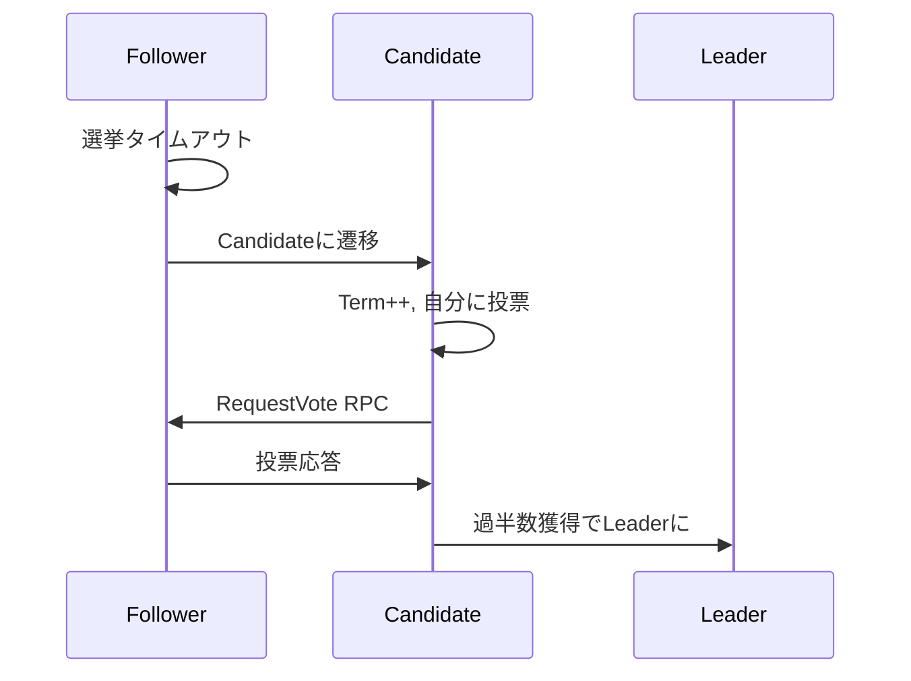

# Raftコアロジック Phase 2 タスク1: リーダー選出アルゴリズム

## 前提条件の確認

Phase 1が完了していることを確認してください：

- [ ] State, Log, Timer の基本実装が完了
- [ ] すべてのユニットテストが通っている
- [ ] MockTimeProviderが動作している

## Phase 2 概要

Phase 2では、Raftの中核となるアルゴリズムを実装します：

1. **タスク1: リーダー選出** ← 今回
2. タスク2: ログレプリケーション
3. タスク3: 安全性保証

## タスク1: リーダー選出の実装

### 実装概要

リーダー選出は、クラスタ内で唯一の意思決定者を選ぶ仕組みです。

- Followerは選挙タイムアウトで選挙を開始
- Candidateは過半数の票を集めてリーダーになる
- より新しいログを持つノードが優先される

### 実装手順

#### 1. 技術仕様書の作成 (`docs/specs/technical/04-leader-election.md`)

````markdown
# リーダー選出仕様

## 概要

Raftのリーダー選出メカニズムを実装する。
分散環境で唯一のリーダーを確実に選出する。

## 選挙の流れ

### 1. 選挙の開始


````

### 2. RequestVote RPC

リクエスト:

- term: 候補者のterm
- candidateId: 候補者のID
- lastLogIndex: 候補者の最後のログインデックス
- lastLogTerm: 候補者の最後のログのterm

レスポンス:

- term: 投票者の現在のterm
- voteGranted: 投票したかどうか

### 3. 投票の条件

ノードが投票する条件:

1. 候補者のterm ≥ 自分のterm
2. そのtermでまだ誰にも投票していない
3. 候補者のログが自分と同じくらい新しい

### 4. ログの新しさ判定

```
if (candidateLastTerm > myLastTerm) return true
if (candidateLastTerm == myLastTerm && candidateLastIndex >= myLastIndex) return true
return false
```

## タイミング制約

- 選挙タイムアウト: 150-300ms（ランダム）
- RPCタイムアウト: 50ms
- 選挙完了目標: 500ms以内

## Split Vote対策

- タイムアウトのランダム化
- 選挙失敗時の再ランダム化
- バイナリエクスポネンシャルバックオフ（オプション）

## エラーケース

- ネットワーク分断での少数派
- 同時に複数の候補者
- 古いtermのリクエスト

````

#### 2. RPCメッセージ型の定義 (`src/types/rpc.ts`)

新しいファイルを作成：

```typescript
import type { NodeId, Term, LogIndex } from './index';

/**
 * RequestVote RPC リクエスト
 */
export interface RequestVoteRequest {
  term: Term;
  candidateId: NodeId;
  lastLogIndex: LogIndex;
  lastLogTerm: Term;
}

/**
 * RequestVote RPC レスポンス
 */
export interface RequestVoteResponse {
  term: Term;
  voteGranted: boolean;
  reason?: string;  // デバッグ用
}

/**
 * AppendEntries RPC リクエスト（ハートビート含む）
 */
export interface AppendEntriesRequest {
  term: Term;
  leaderId: NodeId;
  prevLogIndex: LogIndex;
  prevLogTerm: Term;
  entries: LogEntry[];
  leaderCommit: LogIndex;
}

/**
 * AppendEntries RPC レスポンス
 */
export interface AppendEntriesResponse {
  term: Term;
  success: boolean;
  matchIndex?: LogIndex;
  reason?: string;  // デバッグ用
}

/**
 * RPC結果（ネットワークエラー含む）
 */
export type RPCResult<T> =
  | { ok: true; value: T }
  | { ok: false; error: RPCError };

export type RPCError =
  | { type: 'TIMEOUT' }
  | { type: 'NETWORK_ERROR'; message: string }
  | { type: 'NODE_UNAVAILABLE'; nodeId: NodeId };
````

#### 3. 選挙マネージャーのテスト作成 (`test/unit/consensus/Election.test.ts`)

```typescript
import { describe, it, expect, beforeEach, vi } from 'vitest';
import { ElectionManager } from '@/consensus/Election';
import { RaftState } from '@/core/State';
import { RaftLog } from '@/core/Log';
import { RaftTimer } from '@/core/Timer';
import { MockTimeProvider } from '@/test/utils/MockTimeProvider';
import type { RequestVoteRequest, RequestVoteResponse, NodeId } from '@/types';

describe('ElectionManager', () => {
  let election: ElectionManager;
  let state: RaftState;
  let log: RaftLog;
  let timer: RaftTimer;
  let mockTime: MockTimeProvider;
  let mockRPC: MockRPCClient;

  const nodeId = 'node1';
  const peers = ['node2', 'node3'];

  beforeEach(() => {
    state = new RaftState(nodeId);
    log = new RaftLog();
    mockTime = new MockTimeProvider();
    timer = new RaftTimer(
      {
        electionTimeoutMin: 150,
        electionTimeoutMax: 300,
        heartbeatInterval: 50,
      },
      mockTime,
    );
    mockRPC = new MockRPCClient();

    election = new ElectionManager(nodeId, peers, state, log, timer, mockRPC);
  });

  describe('選挙の開始', () => {
    it('Followerから選挙を開始できる', async () => {
      const onElectionComplete = vi.fn();

      await election.startElection(onElectionComplete);

      expect(state.getState().type).toBe('candidate');
      expect(state.getCurrentTerm()).toBe(1);
      expect(state.getVotedFor()).toBe(nodeId);
    });

    it('自分に投票してから他ノードに要求を送る', async () => {
      const sendRequestVote = vi.spyOn(mockRPC, 'sendRequestVote');

      await election.startElection(() => {});

      expect(state.getVotedFor()).toBe(nodeId);
      expect(sendRequestVote).toHaveBeenCalledTimes(2); // 2つのピア
    });

    it('RequestVoteリクエストが正しい内容を含む', async () => {
      // ログにエントリを追加
      log.appendEntry(1, { type: 'SET', key: 'x', value: 1 });
      log.appendEntry(2, { type: 'SET', key: 'y', value: 2 });

      const sendRequestVote = vi.spyOn(mockRPC, 'sendRequestVote');

      await election.startElection(() => {});

      const expectedRequest: RequestVoteRequest = {
        term: 1,
        candidateId: nodeId,
        lastLogIndex: 2,
        lastLogTerm: 2,
      };

      expect(sendRequestVote).toHaveBeenCalledWith('node2', expectedRequest);
      expect(sendRequestVote).toHaveBeenCalledWith('node3', expectedRequest);
    });
  });

  describe('投票の集計', () => {
    it('過半数の票を獲得したらリーダーになる', async () => {
      // 1票は自分、もう1票でリーダー（3ノードクラスタ）
      mockRPC.setResponse('node2', { term: 1, voteGranted: true });
      mockRPC.setResponse('node3', { term: 1, voteGranted: false });

      const onElectionComplete = vi.fn();
      await election.startElection(onElectionComplete);

      // 非同期処理を待つ
      await mockTime.runAllTimers();

      expect(state.getState().type).toBe('leader');
      expect(onElectionComplete).toHaveBeenCalledWith({
        type: 'ELECTED',
        term: 1,
      });
    });

    it('過半数を獲得できなければCandidateのまま', async () => {
      mockRPC.setResponse('node2', { term: 1, voteGranted: false });
      mockRPC.setResponse('node3', { term: 1, voteGranted: false });

      const onElectionComplete = vi.fn();
      await election.startElection(onElectionComplete);
      await mockTime.runAllTimers();

      expect(state.getState().type).toBe('candidate');
      expect(onElectionComplete).toHaveBeenCalledWith({
        type: 'NOT_ELECTED',
        term: 1,
      });
    });

    it('より高いTermを受信したらFollowerになる', async () => {
      mockRPC.setResponse('node2', { term: 5, voteGranted: false });

      await election.startElection(() => {});
      await mockTime.runAllTimers();

      expect(state.getState().type).toBe('follower');
      expect(state.getCurrentTerm()).toBe(5);
    });
  });

  describe('投票リクエストの処理', () => {
    it('条件を満たす候補者に投票する', () => {
      const request: RequestVoteRequest = {
        term: 2,
        candidateId: 'node2',
        lastLogIndex: 0,
        lastLogTerm: 0,
      };

      const response = election.handleRequestVote(request);

      expect(response.voteGranted).toBe(true);
      expect(response.term).toBe(2);
      expect(state.getVotedFor()).toBe('node2');
    });

    it('古いTermのリクエストは拒否する', () => {
      state.becomeCandidate(); // term = 1

      const request: RequestVoteRequest = {
        term: 0,
        candidateId: 'node2',
        lastLogIndex: 0,
        lastLogTerm: 0,
      };

      const response = election.handleRequestVote(request);

      expect(response.voteGranted).toBe(false);
      expect(response.term).toBe(1);
    });

    it('同じTermで既に投票済みなら拒否する', () => {
      const request1: RequestVoteRequest = {
        term: 1,
        candidateId: 'node2',
        lastLogIndex: 0,
        lastLogTerm: 0,
      };

      const request2: RequestVoteRequest = {
        term: 1,
        candidateId: 'node3',
        lastLogIndex: 0,
        lastLogTerm: 0,
      };

      const response1 = election.handleRequestVote(request1);
      const response2 = election.handleRequestVote(request2);

      expect(response1.voteGranted).toBe(true);
      expect(response2.voteGranted).toBe(false);
      expect(state.getVotedFor()).toBe('node2');
    });

    it('ログが古い候補者には投票しない', () => {
      log.appendEntry(1, { type: 'SET', key: 'x', value: 1 });
      log.appendEntry(2, { type: 'SET', key: 'y', value: 2 });

      const request: RequestVoteRequest = {
        term: 3,
        candidateId: 'node2',
        lastLogIndex: 1,
        lastLogTerm: 1, // 自分より古い
      };

      const response = election.handleRequestVote(request);

      expect(response.voteGranted).toBe(false);
      expect(response.reason).toContain('ログが古い');
    });

    it('ログが同じくらい新しい候補者には投票する', () => {
      log.appendEntry(1, { type: 'SET', key: 'x', value: 1 });
      log.appendEntry(2, { type: 'SET', key: 'y', value: 2 });

      const request: RequestVoteRequest = {
        term: 3,
        candidateId: 'node2',
        lastLogIndex: 2,
        lastLogTerm: 2, // 同じ
      };

      const response = election.handleRequestVote(request);

      expect(response.voteGranted).toBe(true);
    });
  });

  describe('選挙タイムアウト', () => {
    it('選挙タイムアウトで新しい選挙を開始する', async () => {
      const onTimeout = vi.fn();
      election.onElectionTimeout(onTimeout);

      // Followerで開始
      election.startElectionTimer();

      // タイムアウトを発生させる
      mockTime.advance(300);

      expect(onTimeout).toHaveBeenCalled();
      expect(state.getState().type).toBe('candidate');
    });

    it('リーダーになったら選挙タイマーを停止する', async () => {
      mockRPC.setResponse('node2', { term: 1, voteGranted: true });

      await election.startElection(() => {});
      await mockTime.runAllTimers();

      expect(state.getState().type).toBe('leader');
      expect(timer.getActiveTimers().electionTimeout).toBe(false);
    });

    it('投票を受けたらタイマーをリセットする', () => {
      const resetSpy = vi.spyOn(timer, 'resetElectionTimeout');

      const request: RequestVoteRequest = {
        term: 1,
        candidateId: 'node2',
        lastLogIndex: 0,
        lastLogTerm: 0,
      };

      election.handleRequestVote(request);

      expect(resetSpy).toHaveBeenCalled();
    });
  });

  describe('Split Vote対策', () => {
    it('選挙が失敗したら新しいランダムタイムアウトで再試行', async () => {
      mockRPC.setResponse('node2', { term: 1, voteGranted: false });
      mockRPC.setResponse('node3', { term: 1, voteGranted: false });

      const timeouts: number[] = [];
      const getRandomSpy = vi.spyOn(timer, 'getRandomElectionTimeout');
      getRandomSpy.mockImplementation(() => {
        const timeout = 150 + Math.random() * 150;
        timeouts.push(timeout);
        return timeout;
      });

      // 1回目の選挙
      await election.startElection(() => {});
      await mockTime.runAllTimers();

      // タイムアウトで2回目の選挙
      mockTime.advance(timeouts[0]);

      expect(timeouts.length).toBeGreaterThanOrEqual(2);
      expect(timeouts[0]).not.toBe(timeouts[1]); // 異なるタイムアウト
    });
  });
});

/**
 * テスト用のモックRPCクライアント
 */
class MockRPCClient {
  private responses = new Map<NodeId, RequestVoteResponse>();

  setResponse(nodeId: NodeId, response: RequestVoteResponse): void {
    this.responses.set(nodeId, response);
  }

  async sendRequestVote(nodeId: NodeId, request: RequestVoteRequest): Promise<RequestVoteResponse> {
    const response = this.responses.get(nodeId);
    if (response) {
      return response;
    }
    throw new Error(`No mock response for ${nodeId}`);
  }
}
```

#### 4. ElectionManagerの実装 (`src/consensus/Election.ts`)

```typescript
import type { NodeId, Term, RequestVoteRequest, RequestVoteResponse, RPCResult } from '@/types';
import { RaftState } from '@/core/State';
import { RaftLog } from '@/core/Log';
import { RaftTimer } from '@/core/Timer';

/**
 * 選挙結果
 */
export type ElectionResult =
  | { type: 'ELECTED'; term: Term }
  | { type: 'NOT_ELECTED'; term: Term }
  | { type: 'STEPPED_DOWN'; newTerm: Term };

/**
 * リーダー選出を管理するクラス
 */
export class ElectionManager {
  private nodeId: NodeId;
  private peers: NodeId[];
  private state: RaftState;
  private log: RaftLog;
  private timer: RaftTimer;
  private rpcClient: any; // TODO: RPCクライアントの実装

  private onElectionTimeoutCallback?: () => void;
  private currentElectionVotes = new Map<NodeId, boolean>();

  constructor(
    nodeId: NodeId,
    peers: NodeId[],
    state: RaftState,
    log: RaftLog,
    timer: RaftTimer,
    rpcClient: any,
  ) {
    this.nodeId = nodeId;
    this.peers = peers;
    this.state = state;
    this.log = log;
    this.timer = timer;
    this.rpcClient = rpcClient;

    console.log(`選挠マネージャーを初期化: ノード=${nodeId}, ピア=${peers.join(',')}`);
  }

  /**
   * 選挙を開始する
   */
  async startElection(onComplete: (result: ElectionResult) => void): Promise<void> {
    console.log(`選挙を開始: Term ${this.state.getCurrentTerm() + 1}`);

    // Candidateになる
    this.state.becomeCandidate();
    const currentTerm = this.state.getCurrentTerm();

    // 投票をリセット
    this.currentElectionVotes.clear();
    this.currentElectionVotes.set(this.nodeId, true); // 自分に投票

    // RequestVoteリクエストを準備
    const request: RequestVoteRequest = {
      term: currentTerm,
      candidateId: this.nodeId,
      lastLogIndex: this.log.getLastIndex(),
      lastLogTerm: this.log.getLastTerm(),
    };

    // 全ピアに並行して投票要求を送る
    const votePromises = this.peers.map((peer) => this.requestVoteFrom(peer, request));

    // 投票結果を集計
    const responses = await Promise.allSettled(votePromises);

    // 現在もCandidateか確認（途中でステップダウンしている可能性）
    if (this.state.getState().type !== 'candidate' || this.state.getCurrentTerm() !== currentTerm) {
      onComplete({
        type: 'STEPPED_DOWN',
        newTerm: this.state.getCurrentTerm(),
      });
      return;
    }

    // 投票を集計
    responses.forEach((result, index) => {
      if (result.status === 'fulfilled') {
        const response = result.value;

        // より高いTermを見たらFollowerになる
        if (response.term > currentTerm) {
          this.state.becomeFollower(response.term);
          onComplete({ type: 'STEPPED_DOWN', newTerm: response.term });
          return;
        }

        if (response.voteGranted) {
          this.currentElectionVotes.set(this.peers[index], true);
        }
      }
    });

    // 過半数チェック
    const totalNodes = this.peers.length + 1; // ピア + 自分
    const votesReceived = Array.from(this.currentElectionVotes.values()).filter((v) => v).length;
    const majority = Math.floor(totalNodes / 2) + 1;

    console.log(`投票結果: ${votesReceived}/${totalNodes} (過半数=${majority})`);

    if (votesReceived >= majority) {
      // リーダーになる
      this.state.becomeLeader();
      this.timer.stopElectionTimeout();
      console.log(`リーダーに選出されました！Term=${currentTerm}`);
      onComplete({ type: 'ELECTED', term: currentTerm });
    } else {
      // 選挙失敗
      console.log(`選挙に失敗しました。Term=${currentTerm}`);
      onComplete({ type: 'NOT_ELECTED', term: currentTerm });
    }
  }

  /**
   * RequestVoteリクエストを処理する
   */
  handleRequestVote(request: RequestVoteRequest): RequestVoteResponse {
    const currentTerm = this.state.getCurrentTerm();

    console.log(`投票リクエスト受信: from=${request.candidateId}, term=${request.term}`);

    // より高いTermを見たらFollowerになる
    if (request.term > currentTerm) {
      this.state.becomeFollower(request.term);
    }

    // 古いTermのリクエストは拒否
    if (request.term < this.state.getCurrentTerm()) {
      console.log(`古いTermのため拒否: ${request.term} < ${this.state.getCurrentTerm()}`);
      return {
        term: this.state.getCurrentTerm(),
        voteGranted: false,
        reason: '古いTerm',
      };
    }

    // 投票可能かチェック
    const canVote = this.state.canVoteFor(request.candidateId);
    if (!canVote) {
      console.log(`既に投票済みのため拒否: votedFor=${this.state.getVotedFor()}`);
      return {
        term: this.state.getCurrentTerm(),
        voteGranted: false,
        reason: '既に投票済み',
      };
    }

    // ログの新しさをチェック
    const logIsUpToDate = this.isLogUpToDate(request.lastLogTerm, request.lastLogIndex);

    if (!logIsUpToDate) {
      console.log(`ログが古いため拒否`);
      return {
        term: this.state.getCurrentTerm(),
        voteGranted: false,
        reason: 'ログが古い',
      };
    }

    // 投票する
    this.state.recordVote(request.candidateId);
    this.timer.resetElectionTimeout(() => this.handleElectionTimeout());

    console.log(`投票しました: ${request.candidateId}`);

    return {
      term: this.state.getCurrentTerm(),
      voteGranted: true,
    };
  }

  /**
   * ログの新しさを判定
   */
  private isLogUpToDate(candidateTerm: Term, candidateIndex: number): boolean {
    const lastTerm = this.log.getLastTerm();
    const lastIndex = this.log.getLastIndex();

    if (candidateTerm > lastTerm) {
      return true;
    }

    if (candidateTerm === lastTerm && candidateIndex >= lastIndex) {
      return true;
    }

    return false;
  }

  /**
   * 特定のノードに投票を要求
   */
  private async requestVoteFrom(
    peer: NodeId,
    request: RequestVoteRequest,
  ): Promise<RequestVoteResponse> {
    try {
      console.log(`投票要求送信: to=${peer}`);
      const response = await this.rpcClient.sendRequestVote(peer, request);
      console.log(`投票応答受信: from=${peer}, granted=${response.voteGranted}`);
      return response;
    } catch (error) {
      console.error(`投票要求失敗: to=${peer}`, error);
      // エラーの場合は投票なしとして扱う
      return {
        term: request.term,
        voteGranted: false,
        reason: 'ネットワークエラー',
      };
    }
  }

  /**
   * 選挙タイマーを開始
   */
  startElectionTimer(): void {
    this.timer.startElectionTimeout(() => this.handleElectionTimeout());
  }

  /**
   * 選挙タイムアウトハンドラ
   */
  private handleElectionTimeout(): void {
    console.log('選挙タイムアウトが発生');

    if (this.state.getState().type === 'leader') {
      // リーダーは選挙タイムアウトを無視
      return;
    }

    // 選挙を開始
    if (this.onElectionTimeoutCallback) {
      this.onElectionTimeoutCallback();
    }

    this.startElection((result) => {
      if (result.type === 'NOT_ELECTED') {
        // 選挙失敗したら新しいタイムアウトで再試行
        this.startElectionTimer();
      }
    });
  }

  /**
   * 選挙タイムアウトコールバックを設定
   */
  onElectionTimeout(callback: () => void): void {
    this.onElectionTimeoutCallback = callback;
  }
}
```

### 完了チェックリスト

- [ ] 技術仕様書が作成されている
- [ ] RPC型定義が追加されている
- [ ] MockRPCClientが実装されている
- [ ] すべてのテストケースが記述されている
- [ ] テストが失敗することを確認した
- [ ] 実装を行い、すべてのテストが通る
- [ ] ログの新しさ判定が正しく動作する
- [ ] Split voteの対策が実装されている
- [ ] コメントがすべて日本語である
- [ ] `npm run test` で全テストが通る

### コミット

```bash
git add -A
git commit -m "feat: リーダー選出アルゴリズムを実装"
```

### 次のステップ

タスク1が完了したら、タスク2（ログレプリケーション）に進みます。

## 実装のポイント

1. **投票の並行処理**
   - Promise.allSettledで全ノードに並行送信
   - タイムアウトしたノードがあっても処理継続

2. **状態の一貫性**
   - 投票集計中に状態が変わる可能性を考慮
   - より高いTermを見たら即座にFollowerへ

3. **Split Vote対策**
   - 選挙失敗時は新しいランダムタイムアウト
   - 各ノードが異なるタイミングで選挙開始

4. **デバッグ性**
   - 投票の理由を明確にログ出力
   - どのノードが投票したか追跡可能

実装を開始してください。質問があれば聞いてください。
