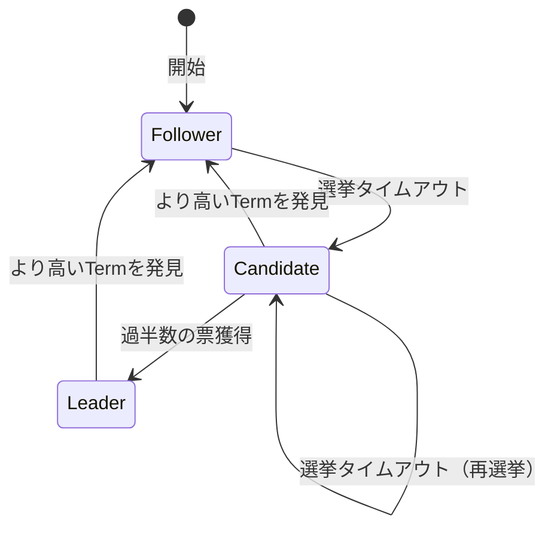

# Raftコンセンサスアルゴリズム - 理論解説書

## 1. はじめに

with AIのプロジェクトだよん。

### 1.1 分散システムの課題

分散システムにおいて、複数のノードが同じ状態を共有し続けることは極めて困難です。ネットワークの分断、ノードの障害、メッセージの遅延や欠落など、様々な障害が発生する可能性があります。このような環境で、すべてのノードが同じ順序で同じ操作を実行することを保証するのがコンセンサスアルゴリズムの役割です。

### 1.2 Raftの誕生背景

Raftは2014年にDiego OngaroとJohn Ousterhoutによって発表されました。従来のPaxosアルゴリズムが理解しにくいという問題を解決するため、「理解しやすさ」を第一の目標として設計されました。

## 2. Raftの基本概念

### 2.1 ノードの3つの状態



**Follower（フォロワー）**

- 受動的な状態
- リーダーからのハートビートを待つ
- クライアントリクエストをリーダーにリダイレクト

**Candidate（候補者）**

- リーダー選出時の一時的な状態
- 他のノードに投票を要求
- 過半数の票を獲得するとリーダーになる

**Leader（リーダー）**

- クラスタの中心的存在
- すべてのクライアントリクエストを処理
- ログレプリケーションを管理

### 2.2 Term（任期）の概念

Termは論理的な時間単位で、単調増加する整数です。各Termは最大1人のリーダーを持ちます。

```
Term 1    |  Term 2   |  Term 3  |  Term 4   | Term 5
------------------------------------------------------
Leader A  | 選挙失敗  | Leader B | Leader B  | Leader C
          | (no leader)|          |           |
```

### 2.3 ログエントリとレプリケーション

各ノードは順序付けられたログエントリの列を保持します：

```
インデックス: 1    2    3    4    5    6
Term:        1    1    1    2    2    3
コマンド:    x=1  y=2  x=3  z=4  x=5  y=6
```

## 3. リーダー選出アルゴリズム

### 3.1 選挙の開始

1. Followerが一定時間（選挙タイムアウト）リーダーからの通信を受信しない
2. CandidateになりTermを増加
3. 自分に投票し、他のノードに投票要求（RequestVote RPC）を送信

### 3.2 投票の条件

ノードは以下の条件をすべて満たす場合のみ投票します：

- 要求のTermが自身のTerm以上
- そのTermでまだ誰にも投票していない
- 候補者のログが自分のログと同じくらい新しい

### 3.3 ログの新しさの判定

```python
def is_log_up_to_date(candidate_last_term, candidate_last_index,
                       my_last_term, my_last_index):
    if candidate_last_term > my_last_term:
        return True
    elif candidate_last_term == my_last_term:
        return candidate_last_index >= my_last_index
    else:
        return False
```

### 3.4 選挙タイムアウトのランダム化

Split voteを防ぐため、各ノードは異なるタイムアウト値を使用：

- 範囲: 150-300ms（典型的）
- ランダム化により同時に選挙を開始する確率を減少

## 4. ログレプリケーション

### 4.1 AppendEntries RPC

リーダーは定期的にAppendEntries RPCを送信：

```typescript
interface AppendEntriesRequest {
  term: number; // リーダーのterm
  leaderId: string; // リーダーのID
  prevLogIndex: number; // 新エントリの直前のログインデックス
  prevLogTerm: number; // prevLogIndexのterm
  entries: LogEntry[]; // 送信するログエントリ（ハートビートの場合は空）
  leaderCommit: number; // リーダーのコミットインデックス
}
```

### 4.2 ログの一貫性チェック

Followerは以下をチェック：

1. prevLogIndexの位置にエントリが存在するか
2. そのエントリのtermがprevLogTermと一致するか

不一致の場合、AppendEntriesを拒否し、リーダーはより古いエントリから再送信。

### 4.3 コミットの仕組み

```
時刻 t1: リーダーがエントリを受信
         ↓
時刻 t2: リーダーが過半数のFollowerにレプリケーション
         ↓
時刻 t3: リーダーがエントリをコミット（ステートマシンに適用）
         ↓
時刻 t4: 次のAppendEntriesでFollowerに新しいcommitIndexを通知
         ↓
時刻 t5: Followerもエントリをコミット
```

## 5. 安全性の保証

### 5.1 選出安全性（Election Safety）

**定理**: 1つのtermには最大1人のリーダーしか存在しない

**証明**:

- 各ノードは1つのtermで最大1回しか投票しない
- リーダーになるには過半数の票が必要
- 過半数は1グループしか存在し得ない

### 5.2 ログ一致性（Log Matching）

**定理**: 2つのログエントリが同じインデックスと同じtermを持つなら、

- そのエントリは同じコマンドを含む
- それより前のすべてのエントリも同じである

### 5.3 リーダー完全性（Leader Completeness）

**定理**: あるtermでコミットされたエントリは、それ以降のすべてのtermのリーダーのログに存在する

この性質により、一度コミットされたデータは失われません。

### 5.4 ステートマシン安全性（State Machine Safety）

**定理**: すべてのノードが同じ順序で同じコマンドを実行する

## 6. 実装上の重要な考慮事項

### 6.1 タイミングパラメータ

```
broadcastTime << electionTimeout << MTBF

典型的な値:
- broadcastTime: 0.5-20ms
- electionTimeout: 150-300ms
- MTBF: 数ヶ月
```

### 6.2 パフォーマンス最適化

**バッチング**: 複数のコマンドを1つのAppendEntriesで送信

**パイプライニング**: 前のRPCの応答を待たずに次を送信

**並列化**: 複数のFollowerに同時にRPCを送信

### 6.3 メンバーシップ変更

クラスタ構成の変更は特別な処理が必要：

1. Joint Consensus（2段階コミット）
2. 単一サーバー追加/削除

## 7. KVストアへの適用

### 7.1 コマンドの種類

```typescript
type Command =
  | { type: 'SET'; key: string; value: any }
  | { type: 'DELETE'; key: string }
  | { type: 'CAS'; key: string; oldValue: any; newValue: any };
```

### 7.2 線形化可能性（Linearizability）

強一貫性を保証するための読み取り処理：

**方法1: ログエントリ経由**

- 読み取りもログに記録
- レイテンシが高い

**方法2: リースベース読み取り**

- リーダーが一定期間リースを保持
- リース期間中は直接読み取り可能

### 7.3 スナップショット

ログが無限に増大するのを防ぐ：

1. 定期的にステートマシンの状態をスナップショット
2. スナップショットまでのログを削除
3. 新しいノードにはスナップショットから開始

## 8. 障害シナリオと対処

### 8.1 ネットワーク分断

```
[Node A, Node B] | [Node C, Node D, Node E]
   少数派グループ  |  多数派グループ
   （書き込み不可） | （正常動作）
```

### 8.2 リーダー障害

1. Followerが選挙タイムアウト
2. 新しい選挙開始
3. 新リーダー選出（通常500ms以内）

### 8.3 遅いFollower

- リーダーは各Followerの進捗を追跡
- 必要に応じて古いエントリから再送信
- 極端に遅い場合はスナップショットを送信

## 9. まとめ

Raftの主要な特徴：

- **理解しやすさ**: 明確に分離されたリーダー選出とログレプリケーション
- **強いリーダー**: すべての決定はリーダーが行う
- **安全性**: 数学的に証明された安全性保証
- **実用性**: 多くの本番システムで採用（etcd、Consul、TiKV等）

Raftは分散システムにおける合意形成の問題を、理解しやすく実装しやすい方法で解決します。この理論的基盤により、信頼性の高い分散KVストアを構築することが可能になります。
